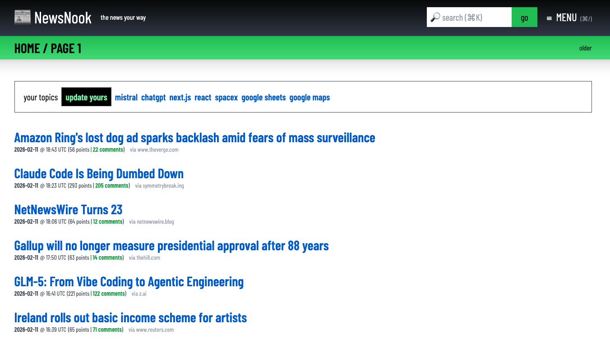
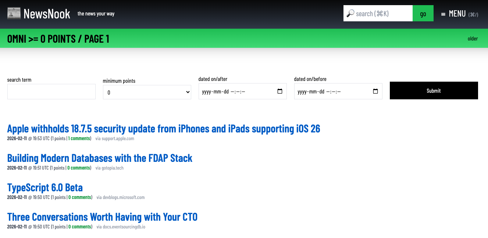
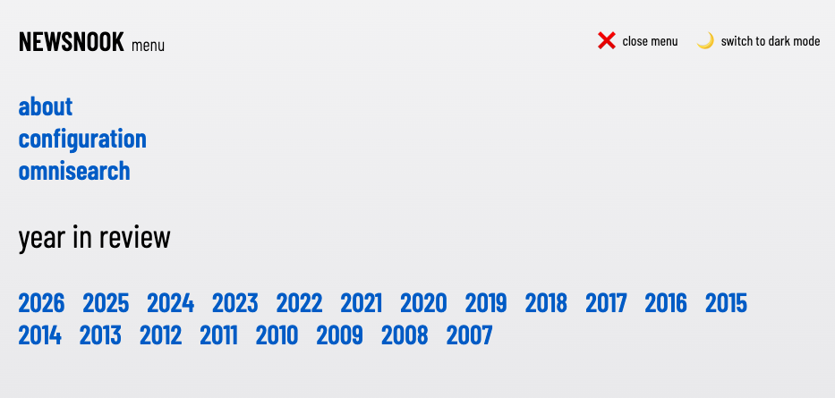

# NewsNook

nesting the daily news in a more restful way



a news headlines list-er and narrow-downer for [Hacker News](https://news.ycombinator.com)

## Forewords

Wanted to gather worldly (and wordy) news in a cleaner way, I built this "wrapper" of [Hacker News](https://news.ycombinator.com)...

Let's match up this: 


with this:


Some may want the former, while I made the latter? Why? Well...

## Hallmarks



This web work has: 

*   a "home page" that shows the latest news with a more "roomy" feel
    
*   an "omni search page" that narrows down news by
    
    *   keywords
        
    *   points ("votes") threshold
        
    *   day ("from" and "to")
        
*   a "configuration page" 
      
    *  uses "cookies" to hold:
    
       *   nooks ("topic filters") in the home page
        
       *   points ("votes") threshold
  
So, it not only "looks good" but also does some "work" with the news ;)


        
*   a full screen "menu" 
   


*   a light / dark / "system" layout


This web work makes note of: 

* front-end: 
  * [Next.js](https://nextjs.org/docs)
  * [Tailwind CSS](https://tailwindcss.com/docs/installation)
* back-end:
  *  [Hacker News API](https://hn.algolia.com/api)

## Runtimes

Run the build on either:

<a href="https://newsnook.joncoded.com" target="_blank"><button>newsnook.joncoded.com</button></a>

or

<a href="https://newsnook.vercel.app" target="_blank"><button>newsnook.vercel.app</button></a>

## Setup

Truly, there isn't much to it ... go run these in "Terminal": 

```
$ git clone https://github.com/jonchius/newsnook.git
$ npm install
$ npm run dev
```

Then, hack at will...

## Thanks

* [Hacker News API](https://hn.algolia.com/api) for the news